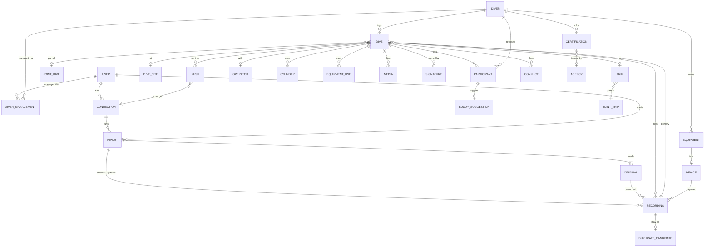

# Data model

Conceptual model, not a database schema. Terms are defined in the [glossary](../glossary.md).
The decision to have an own model is [ADR 0003](../decisions/0003-own-data-model-uddf-as-adapter.md).

## Ownership tiers

Every entity belongs to exactly one tier. This answers "who can see/change it" and
"what moves when a Diver changes hands".

| Tier | Entities |
|---|---|
| **Instance** (shared by all Users) | User, Dive site (→ External IDs), Site import, Operator, Agency catalog |
| **User** | Connection (→ Diver mappings), Import, Original, external Divers they created |
| **Diver** (via the Users who manage it) | External IDs, Dive (→ Recordings, Cylinders, Participants, Media, Signatures, Pushes), Trip, Certification, Membership, Insurance, Medical exam, Equipment (incl. Devices), Site note |

## Overview

## Cross-cutting rules

These apply to every entity unless stated otherwise. They close gaps A2, A3, A5 and A8.

- **Identity (A2):** every record has a global ID (e.g. UUID) assigned by the hub.
  Records that come from outside also carry **external references**
  (`source`, `external id`, plus `device serial` where relevant) with uniqueness per source.
- **Provenance (A3):** every Recording points to its Import and Original(s). Every
  change to logbook data is a **Revision** whose actor is a User, an Import or the
  system (auto-attach, Buddy suggestion acceptance) and which records old and new values.
- **Change tracking (A5):** Revisions per change; deletes are soft (tombstones), so
  Imports, Pushes and incremental sync can see them. Bad Imports can be undone.
- **Time (A8):** instants are stored as UTC **plus** the local UTC offset at the dive.
  The offset comes from the Device, the site's timezone or the User, in that order of trust.
- **Units:** SI internally (m, s, K, Pa, m³), as in UDDF; display units are a per-User preference.

## Entities

### People and accounts

**User** — sign-in identity, preferences (units, default Visibility), instance role
(admin or regular; more roles are an open question).

**Diver** — personal data (name, birth date, contact details, emergency contact), plus
merge pointer (`merged into`) for the claim case. A Diver either has a logbook
(managed Divers) or is only referenced (external Divers / "contacts").
*External IDs (ADR 0024):* `(Diver, Source, external id)`. They're unique per Source among Divers that aren't merged, and a
Diver has at most one per Source. They record the person's account at a service (SSI account ID, a PADI account).
Setting one that another Diver already has proposes linking the two Divers (as in the claim case). Certification
numbers (SSI card ID, PADI diver number) stay on Certification; professional numbers (SSI and PADI pro numbers) stay on
Membership.
*Implemented (slice 10):* `diver_external_id` (Sources `ssi`, `padi`), set by connecting a Diver to SSI; a clash is
refused for now (`ssi_account_taken`) instead of proposing a link.
*Seen by every User (ADR 0028, slice 14):* every User sees every Diver by id and name (`GET /api/divers/search`),
nothing else of Divers they don't manage. An **external Diver** has no Diver management at all: `diver.created_by`
keeps who added it; any User renames it, its creator or an admin deletes it (soft) while no Participant points to it.
External IDs can be set by hand (`PUT /api/divers/{id}/external-ids/{source}`: an external Diver's by anyone, a managed
one's by its Users), refused while a Connection uses the account or when another Diver has it (naming that Diver).
Changes to external Divers and External IDs set by hand are Revisions on the Diver (`entity_type = 'diver'`).

**Diver management** — `(User, Diver, role)`. A User's *own* Diver is flagged. Several
Users can manage one Diver (two parents; a dive center handing a guest's log over to
the guest). External Divers are managed by no one (ADR 0028): shared like Dive sites.

**Certification** — Diver, Agency (catalog entry or free text), level (catalog or free
text), number, date, instructor (Diver reference or text), card images (Media),
verification state (`self-declared`, `card seen`, `verified with agency`). Covers B3.

**Membership** (0..n per Diver, B4), **Insurance** (policy number, insurer contact,
coverage, validity; B5), **Medical exam** (date, result, valid until, examiner), **Dive permit**.

**Agency** — instance catalog (SSI, PADI, CMAS, …) with optional level catalog.

### Dives

**Dive** — one Diver's logbook entry.
- *Owner:* Diver. *Number:* the Diver's own dive number.
- *Time and depth:* start (UTC + offset), duration, max/avg depth, surface interval.
  These are derived from the Primary recording; any of them can be an **Override**.
  *Implemented (ADR 0015):* number, start + offset, duration, max/avg depth and water temperature
  are columns holding the value in effect, with `overrides` naming the fields set by
  hand; `version` grows with every change (optimistic locking); notes are the Dive's own.
  The water type was one of them until ADR 0025 moved it to the Dive site.
  *Implemented ([ADR 0030](../decisions/0030-importing-dives-from-providers.md), slice 15):* `utc_offset_source` says where the offset came from (`device`, `position`, `nearby`,
  `unknown`; `unknown` keeps the local wall-clock time as if UTC, and matching compares local times); it follows the
  Primary recording like the start. A Dive can have **no Recording**: one made from a Provider's logbook entry
  (`from_provider`), with the entry's values (not Overrides) until a Recording attaches and becomes primary.
- *Place:* Dive site; entry and exit positions (B6); Operator (dive center / boat, B7); Trip.
- *Conditions (B9):* water type (salt/fresh/brackish), water/air temperature,
  visibility, current, surface conditions, weather.
  *Implemented (ADR 0025):* the **water type is the Dive site's**, not a Dive value: a Dive without a site has
  none. When the Primary recording's computer was set to other water, the Dive says so (`waterMismatch`, with how
  far its depths read off).
- *Gas and gear:* Cylinders, weights, Equipment uses (B10, B11).
- *Experience:* dive type/purpose, rating, notes, tags, problems.
- *Social:* Participants, Joint dive, Visibility, Signatures.
- *Hub state:* Pushes, Conflicts, Revisions.
- *Deleting (ADR 0026, implemented):* soft, with a Revision (`delete`). The Dive and its Recordings get the same
  tombstone; Originals and samples stay. A deleted Dive counts nowhere (lists, search, site and Diver counts, Duplicate
  candidates, overlap matching) and can be **restored** with the Recordings deleted with it (`restore`; a site deleted
  meanwhile becomes the one it was merged into, else none). Only Users who manage the Diver delete or restore.

**Joint dive** — the shared facts of one descent (site, time window, Operator) and its
member Dives. Created when a Buddy suggestion is accepted, or by hand.

**Participant** — `(Dive, Diver, role)`, with roles `buddy`, `guide`, `instructor`,
`student`, `team member` (B7). If the Diver is managed by another User, a **Buddy
suggestion** is raised. Nothing appears in that User's logbook until they accept.
*Implemented (ADR 0028, slice 14):* `participant` with roles `buddy`, `guide`, `instructor`; one role per Diver and
Dive, never the Dive's own Diver; set as one list (`PUT /api/dives/{id}/participants`) with the Dive's version and a
Revision (`participants`). Buddy suggestions and Joint dives are not built: another User's Diver can be put on a Dive,
and nothing reaches that User.

**Recording** — data from one Device for one Dive.
- Device, Import, Original(s) plus position within the Original (one file can hold many dives).
- *Recording key* for re-imports: `(Device serial, device-native dive number or start time)`;
  without a Device, `(Source, external id)`.
- Device summary: the union of libdivecomputer's parser fields and FIT `dive_summary`/`dive_settings`
  (dive mode OC/CCR/SCR/gauge/apnea, deco model and GF, salinity (the computer's water setting and density,
  kept here: ADR 0025), atmospheric pressure,
  CNS/OTU start/end, SAC/RMV, ascent rates, TTS at end, gas mixes, tanks, location) (B8).
- **Sample series**: time, depth, temperature, pressure per sensor, PO2 (set/measured/
  per sensor), CNS, NDL, deco stop/ceiling, TTS, heading, heart rate, GPS (B6), events
  (gas switch, alarms, bookmarks, setpoint changes). Unknown source fields are kept in a
  per-source extension area (A7) rather than dropped.
- *Source logbook fields*: notes, buddy names, site name and similar values the Source
  delivered (UDDF, Subsurface). They're kept as the baseline for 3-way merges on re-import.
- *Positions (B6, implemented in ADR 0020):* entry and exit position from the Device, both optional.
  The Dive shows its Primary recording's (exit, else entry); they stay as private as the Dive.
- Detaching a Recording from its Dive is always possible. The Recording then gets its
  own Dive or becomes a Duplicate candidate.
- *Deleted with its Dive (ADR 0026):* a re-import with its key (the same file, or a re-export) is skipped as
  `deleted_earlier`. The key stays taken for every User, so restoring never clashes with a newer Recording.
- *A Provider's copy ([ADR 0030](../decisions/0030-importing-dives-from-providers.md), implemented):* a dive the Provider got from a dive computer becomes a Recording with
  parser `ssi-app-api` and key `ssi:<SSI dive ID>`, its Device found by manufacturer and serial number (created for the
  Connection's Diver if new), its offset from the position or nearby Dives (`utc_offset_source`). Placed like a file's.
  A file's Recording attaching to a Dive whose primary is a Provider's copy becomes primary; any Recording attaching to a
  Dive without one becomes primary.

**Cylinder** — per Dive: Equipment item (optional), volume, working pressure, material,
gas mix (O2/He), start/end pressure, usage window. **Sensor mapping** links a
Recording's pressure sensor (e.g. transmitter serial) to a Cylinder (Subsurface idea, B11).

**Weight** — per Dive: amount, type (belt, integrated, trim).

**Equipment use** — `(Dive, Equipment item, configuration note)`.

**Media** — file (content hash, stored copy or URI), kind (image/video/audio/document),
taken-at time, offset within the Dive, geotag; attached to a Dive, Dive site or
Certification (B13).

**Signature** — Dive, signer (User, or external name + role + agency + cert number),
method (in-app, drawn on device), signed at, **signed snapshot** (the Revision plus
a hash of the signed fields). It becomes a Stale signature when any signed field changes (B1).

### Places and trips

**Dive site** — instance-wide: name, aliases, position (WGS84), country/region, water body,
environment, typical/max depth, entry points, **external IDs** (e.g. SSI site ID needed
for Pushes, shared site databases; B14), creator, `merged into`.
*Implemented (ADR 0020):* name, position (latitude/longitude, no PostGIS), country (ISO code), body of
water, description, creator, `merged into` (merging later), version; any User edits (Revisions), the
creator or an admin deletes while unused. A Dive links to one site (`site`, the Dive's own value);
an Import links a new Dive to the only site within 200 m of its position.
*Implemented (ADR 0021):* maximum depth; **External IDs** `(site, Source, external id)`, unique per Source, at
most one per Source and site (`osm`, `wikidata`, `ssi`). Each either *provides data* (keeps the values its Source
delivered last, the base for the next import's 3-way merge) or is a *reference* (hand-made site linked by an
import, or an SSI ID typed in). License, Attribution and link pattern belong to the Source, defined once in code.
*Implemented (ADR 0025):* **water type** (fresh, salt or brackish), the water type of every Dive at the site;
any User edits it, imports merge it per field (only SSI fills it), merging fills it as a gap. A reference on a
hand-made site keeps its Source's values as an **offer**; any User takes it ("Use SSI's data": empty fields
fill, the reference then provides data, Revision cause `adopt`). An SSI ID typed on a site with import data
provides data once an SSI import finds it. Which Source's value wins is set per field (SSI first for name,
country and water type; OSM for position).

**Site import** — instance-wide, started by an admin: Sources (OSM, Wikidata, SSI; an imported SSI ID provides
data, ADR 0025), area (country, box or everywhere), whether it creates sites or only fills those already here,
language for names, who confirmed ODbL and when, when the SSI explanation was confirmed, status, progress, counts
(created, updated, unchanged, kept, linked, offered, skipped, skipped as new, gone from the Source, failed) and
findings (new sites near existing ones; hand-made sites that now offer a Source's data).
Revisions it writes on sites have the actor `site_import` (ADR 0021).
*Merging (ADR 0022):* any User merges a site into another. The kept site wins and its gaps are filled; Dives move
(Revision by the system, cause `site-merge`); External IDs move where the kept site has none from that Source;
`merged into` points to the kept site, and imports follow it.

**Site note** — a Diver's private notes and rating for a Dive site.

**Operator** — instance-wide: dive center, shop, liveaboard operator; vessels (UDDF `business`, `divebase`).

**Trip** — owned by one Diver: name, dates, Operator, vessel, accommodation; groups Dives.
**Joint trip** links the Trips of several Divers.

### Equipment

**Equipment item** — Diver, category (open list incl. hood, SMB/reel, weight system,
undergarment, transmitter, dive computer), maker, model, serial, purchase data,
category-specific properties (e.g. tank volume, working pressure, material),
**service records** (date, by whom, what; next due) (B10).

**Device** — an Equipment item that records data (dive computer, transmitter):
serial number, firmware history. Assigning a Device to a Diver is how Imports attribute Recordings.
*Implemented (ADR 0016):* reassigning affects only Imports from then on; single Dives can be moved.

### Data in and out

**Connection** — User, Source or Target type, configuration (watched folder, credentials
reference, account ID), state.
*SSI (ADR 0024):* the SSI account ID (it also becomes the External ID of the User's own Diver); the token, and the
password only if the User chose "Keep me signed in" (both encrypted with the operator's key); last successful use;
state `active`, `needs sign-in` or `failed`. Disconnecting deletes the password and token.
*Diver mappings:* `(Connection, Diver, remote id)` for Targets whose people are records of one account, such as an
entry in the User's SSI buddy list. They're set by the User, or matched through the Diver's SSI External ID.
*Not built (ADR 0029):* SSI finds a buddy's entry by the Diver's SSI External ID at send time; every entry seen has an
SSI account. Mappings come if an entry without one turns up.
*Implemented (slice 10):* `connection` for SSI, one per User and Diver, with `state` and `keep_signed_in`; Diver
mappings are not built yet (buddies aren't sent).
*Providers (ADR 0027, slice 13):* a Connection belongs to a **Provider** (`provider`, checked against the registry, not an
enum), one per User, Diver and Provider. It keeps the account (`account_id`, `account_label`) and **one sealed
`credentials` value** shaped by the Provider's sign-in kind (password: login, the current access, the password when kept;
token: the token). Migration 0013 dropped the old token and password, so Connections made before sign in again once.
*Importing dives ([ADR 0030](../decisions/0030-importing-dives-from-providers.md), slice 15):* `import_mode` (`off`, `add`, `create`), `import_window_minutes` (5, 15, 30, 60)
and `import_computers` (the choice per dive computer found there, `recordings` or `entries`, by `manufacturer:serial`;
kept on the Connection, not the Device).

**Original** — User, content hash, media type, size, received at, stored bytes. It's immutable.
The same hash received again **from the same User** is not processed a second time. Originals are
never shared between Users, so a hash match reveals nothing about other Users' files.
Archives (zip, nested zips in a Garmin account export) are unpacked; each contained file becomes
an Original, and the Import records the archive's name and hash.
*From a Provider ([ADR 0030](../decisions/0030-importing-dives-from-providers.md)):* one Original per dive, that dive's record as JSON (`application/json`), never the whole
answer (which holds the buddy list's personal data). An unchanged dive has the same hash next time.

**Provider site data** — an admin's permission per Provider (`provider_site_data`: provider, allowed at, allowed by) to
make Dive sites from its site data when Users import dives (ADR 0030, slice 15a). A dive's site is otherwise only found
by its ID or matched by name and position (and then gets the ID as a reference).

**Import** — User, Connection (optional for manual upload), Originals, started/finished, status,
outcome per dive (`created`, `attached`, `updated`, `unchanged`, `duplicate candidate`, `skipped`, `failed`; skipped
with `deleted_earlier` for a Recording of a deleted Dive, ADR 0026).
*From a Provider ([ADR 0030](../decisions/0030-importing-dives-from-providers.md), implemented):* `provider`, `connection_id` and a `plan`: the records' context (entry of the
buddy list → SSI account, SSI site → name and position; no names of people), the choice per computer, the decisions for
ambiguous entries, the choices for fields changed both there and here (`conflicts`), the mode, window and Diver it ran
with. Fields changed only at the Provider since the last import (or the last send) are taken back by a three-way
comparison (ADR 0030, slice 15b). Its Originals are stored when it starts; the worker runs it
like an upload. Outcomes carry `remoteId` and `remoteNumber`; results add `linked`; reasons add `sent_by_dive_hub`,
`no_match`, `ambiguous`, `left_out`. Matches are linked by `link` Pushes, up to date for Dives made from the Provider.
An Import can be undone through its Revisions.

**Duplicate candidate** — Recording, candidate Dives, reason (several overlaps, depth mismatch,
unknown Device), resolution. *Implemented (ADR 0016):* resolutions `attached`, `new_dive`,
`discarded` (the Recording stays, detached, and can be reopened). A deleted candidate Dive is no longer offered; the
candidate keeps it and offers it again once restored (ADR 0026).

**Conflict** — Dive, field, base value, hub value, incoming value, where the incoming value came
from (Import or client edit), resolution.

**Push** — Dive, Connection (Target), mode (`QR payload`, `API`, `browser automation`),
state (`pending`, `handed over`, `confirmed`, `failed`, `outdated`), remote ID if known,
**pushed snapshot** (Revision plus the payload). It becomes `outdated` when a pushed field changes (A6).
*API mode (ADR 0024):* also **remote number** (the Target's own dive number, which differs from the Dive's), **remote
reference** (a stable value we send, for finding the dive again when an answer is lost) and **read-back result**
(fields the Target stored differently). `confirmed` means delivered with an ID back; it isn't SSI's dive-centre
confirmation. Re-pushing an `outdated` Push updates the same remote dive: a new Push with the same remote ID.
*Implemented (slice 10):* `push` with `action` (`create`, `update`, `link`, `delete`), `state`, remote ID, number and
reference, the record sent (without samples) and a `fingerprint` of it; `outdated` is the fingerprint differing from
the Dive's current one, worked out when asked, not stored.
*Providers (ADR 0027, slice 13):* `push.provider` instead of `target`; the fingerprint is the adapter's; `remote_gone` marks a
Push that found the remote dive deleted there (it was a failure code before). A Provider without an ID back records
`handed_over`, which has no current remote dive, so sending again hands it over again.

## UDDF checklist

| UDDF section | Dive Hub | Phase |
|---|---|---|
| `generator` | Import/Original metadata; written on Export | now |
| `mediadata` | Media | now |
| `maker` | Equipment maker (text or catalog) | now |
| `business` | Operator | now |
| `diver/owner`, `buddy` | Diver + Diver management; external Divers | now |
| `…/equipment` | Equipment item, Device, service records | now |
| `…/medical`, `insurance`, `divepermission` | Medical exam, Insurance, Dive permit | now |
| `…/education` (certifications) | Certification, Agency | now |
| `…/membership` | Membership (0..n) | now |
| `divesite/divebase` | Operator | now |
| `divesite/site` (geography, environment) | Dive site | now |
| `divesite/site` (fauna/flora, wreck, cave details) | Dive site extension | later |
| `divetrip` | Trip, Joint trip, Operator/vessel | now |
| `gasdefinitions` | Gas mix on Cylinder / Recording | now |
| `profiledata` (dive, samples) | Dive, Recording, Sample series | now |
| `decomodel` | Deco model + GF on Recording summary only | now (summary) |
| `divecomputercontrol/divecomputerdump` | Original | now |
| `tablegeneration`, `setdcdata` | — | out of scope |

## Gap coverage

| Gap | Covered by |
|---|---|
| A1 single owner | User, Diver management, Participants, Joint dive |
| A2 identifiers | Global IDs + external references, Recording key |
| A3 provenance | Import, Original, Revision actor |
| A4 one profile | Several Recordings per Dive, Primary recording |
| A5 change tracking | Revisions, soft deletes |
| A6 sharing/broadcast | Visibility, Push |
| A7 extensions | Per-source extension area on Recording; Originals kept |
| A8 timezone | UTC + local offset |
| B1 signatures | Signature, Stale signature |
| B2 training | — (later: courses, training dives, skills) |
| B3 certifications | Agency catalog, card images, verification state |
| B4 membership | 0..n Memberships |
| B5 insurance | Insurance fields |
| B6 location | Entry/exit position on Dive, GPS in samples |
| B7 roles | Participant roles, Operator per Dive |
| B8 metrics | Recording summary + sample fields from FIT/libdivecomputer |
| B9 conditions | Dive conditions |
| B10 equipment | Open categories, working pressure, service records, firmware |
| B11 equipment usage | Equipment use, Sensor mapping |
| B12 freediving | Dive mode `apnea` only; sessions later |
| B13 media | Media with hash, offset, geotag |
| B14 sites | External IDs, entry points, aliases, merge |
| B15 person data | Free-form where UDDF uses dated enums |
| B16 gas logistics | — (later: fill records) |

## Scenarios

### 1. Same dive from Garmin and Suunto

Tim dives with a Garmin Descent (primary) and a Suunto EON as backup.

1. The watched-folder Connection picks up the Garmin FIT. This creates Original O1 and
   Import I1. The Device (Garmin serial) is assigned to Tim's Diver. No Dive of Tim's
   overlaps in time, so a new Dive D1 is created with Recording R1, which becomes the Primary recording.
2. Tim uploads the Suunto export: **FIT + JSON** for the same dive (two Originals, one
   Import I2). The parser combines them into one Recording R2 (JSON lacks the gas mix,
   FIT supplies it), which links to both Originals.
3. R2 overlaps exactly one Dive (D1), so it is **auto-attached** as a second Recording.
   D1's summary still comes from R1, and Tim is notified.
4. Tim thinks the Suunto depth is right and sets max depth as an Override (Revision, actor Tim).
   Alternatively he makes R2 the Primary recording.

Edge cases:
- *Clock drift:* the Suunto clock is 3 min off. Overlap matching uses a tolerance window,
  and the Recording keeps its own start time.
- *Split dive:* Garmin split a dive at a 2-min surface break, producing D1 and D2.
  Suunto's single R2 overlaps both, so it becomes a **Duplicate candidate**, not auto-attached.
- *Re-import of the account export zip:* Originals with identical hashes are skipped. A different
  Original with a known Recording key updates R1 in place (Revision, actor Import).
- *Unknown Device:* the first Suunto Import asks once which Diver owns it and remembers the answer.

### 2. Buddy who is a User, buddy who isn't

**Anna is a User.** Tim adds Anna's own Diver as Participant `buddy` on D1, which raises
a Buddy suggestion to Anna. *As built (slice 14):* Tim can add Anna's Diver (he sees her name); the suggestion and
everything after it come later.
- Anna already has an overlapping Dive A1 from her Garmin. Accepting links D1 and A1 into
  a Joint dive. Each keeps its own notes, gear and Recordings.
- Anna has no Dive (no computer). Accepting creates A1 with the shared facts (site,
  time, Operator, Participants) but no Recording. *Open:* may A1 show Tim's Recording?
- Anna declines. Tim still sees Anna as his buddy, but nothing is created for her.

**Bob is not a User.** Tim creates an external Diver "Bob" (every User sees the name; ADR 0028), and
adds him as Participant. Bob signs D1 on Tim's phone, which creates an external Signature.
Later Bob signs up. Tim **links** his "Bob" to Bob's own Diver (`merged into`).
Tim's Participants now point to Bob's Diver, which raises Buddy suggestions for the past
dives (as one batch). Signatures stay unchanged.

### 3. Re-import of a dive edited elsewhere

Tim keeps using Subsurface and imported dive D5 from a UDDF export. R5's source
logbook fields were: site "Hausreef", notes "A".

- In the hub he changes notes to "B".
- In Subsurface he changes the site to "Hausreef Nord" and notes to "C", and exports again.

On re-import, R5 is matched by its Recording key (device serial + start time; UDDF's file-local IDs
are useless here). Samples are unchanged, so R5 itself stays as it is. The 3-way merge uses the previous source
fields as the base:
- **Site** changed only at the Source. D5's site is updated (Revision, actor Import).
- **Notes** changed on both sides. The hub value "B" stays and a **Conflict** offers "C".

Follow-on effects: if the site was signed, that Signature becomes a Stale signature. If D5 was
pushed to a Target, the Push becomes `outdated`.
If the Subsurface dive has **no Device data** (manually logged), the key falls back to
`(Source, start time ± tolerance, Diver)`. An ambiguous match becomes a Duplicate candidate.

### 4. Dive pushed to SSI, then changed

Outbound comes in a later phase (see [spec](README.md)), but the model already supports it.

With an SSI Connection, Dives go through SSI's app API ([ADR 0024](../decisions/0024-ssi-target-via-app-api.md)):

1. Tim sends D1 to SSI. The hub reads Tim's SSI logbook once and finds no dive within ±2 min of D1, so it creates one
   with D1's summary and profile. The Push P1 records mode `API`, the pushed snapshot, SSI's dive ID and number, and
   state `confirmed` (delivered). It reads the dive back and notes that SSI rounded the duration to whole minutes.
   SSI still shows the dive as unconfirmed: only a dive center can confirm it there.
   The payload needs D1's site's **SSI site ID** (an External ID on the Dive site). Without one, Tim picks or types it first.
2. Tim then corrects max depth. A pushed field changed, so P1 becomes `outdated`.
3. Tim re-pushes. P2 has P1's remote ID: the hub fetches SSI's current record, puts its changes on top (so a rating
   Tim set in the app survives) and updates the same SSI dive. P1 stays in the history.
4. Tim deletes D1. It's a soft delete (D1 and R1 get a tombstone and a Revision; O1 stays). The same dialog asks
   whether to delete the dive in SSI too ([ADR 0026](../decisions/0026-deleting-dives.md)):
   - *Yes:* the hub deletes it in SSI first (P3, action `delete`), then here. If SSI fails, nothing is deleted. With
     several Providers, the dialog asks about each one the Dive is at (ADR 0027).
   - *No:* P2 stays. D1 is listed under "Deleted dives" as still in SSI, with "Delete in SSI", and the logbook reminds
     Tim until it's gone from SSI.
   Re-importing O1 (or a re-export of the dive) is skipped as "deleted earlier". Restoring D1 brings it back here, not
   to SSI.

Edge cases:
- *Token expired:* Tim chose "Don't store my password". The Push waits, and the Connection shows "Sign in to SSI again".
- *Without a Connection (QR payload, later):* P1 is `handed over`, because a QR code can't confirm delivery. SSI can't
  update such a dive, so re-pushing would create a second SSI entry: the hub warns, and Tim fixes it in SSI by hand
  or re-pushes (P2, with P1 kept).
- *The answer is lost:* the next attempt finds the dive in SSI's logbook by the Push's remote reference and links it,
  instead of creating it twice.

## Open questions

- **Discoverability:** how does Tim find Anna's Diver? Options: a directory of Users' own Divers
  for the whole instance, search by exact e-mail only, or contacts only.
- **Borrowed recording:** may a buddy without a computer show another Diver's Recording on their Dive (read-only)?
- **Roles beyond admin** (dive center staff, instructor): what may they do with Divers they don't manage?
- **Freediving sessions (B12), training (B2), fill records (B16):** confirmed as later?
- **Full-fidelity backup/restore format** (separate from UDDF Export).
- **Overlap tolerance and depth-mismatch thresholds** for auto-attach: to be tuned with real files.
