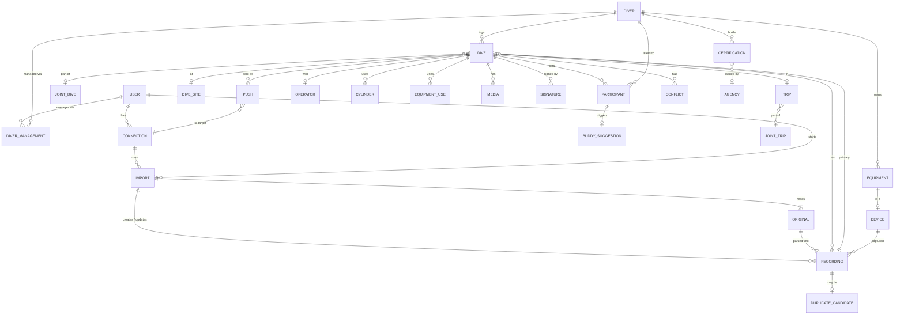

# Data model

Conceptual model, not a database schema. Terms are defined in the [glossary](../glossary.md).
The decision to have an own model is [ADR 0003](../decisions/0003-own-data-model-uddf-as-adapter.md).

## Ownership tiers

Every entity belongs to exactly one tier. This answers "who can see/change it" and
"what moves when a Diver changes hands".

| Tier | Entities |
|---|---|
| **Instance** (shared by all Users) | User, Dive site, Operator, Agency catalog |
| **User** | Connection, Import, Original, external Divers they created |
| **Diver** (via the Users who manage it) | Dive (→ Recordings, Cylinders, Participants, Media, Signatures, Pushes), Trip, Certification, Membership, Insurance, Medical exam, Equipment (incl. Devices), Site note |

## Overview

## Cross-cutting rules

These apply to every entity unless stated otherwise. They close gaps A2, A3, A5 and A8.

- **Identity (A2):** every record has a global ID (e.g. UUID) assigned by the hub.
  Records that come from outside also carry **external references**
  (`source`, `external id`, plus `device serial` where relevant) with uniqueness per source.
- **Provenance (A3):** every Recording points to its Import and Original(s). Every
  change to logbook data is a **Revision** whose actor is a User, an Import or the
  system (auto-attach, Buddy suggestion acceptance) and which records old and new values.
- **Change tracking (A5):** Revisions per change; deletes are soft (tombstones), so
  Imports, Pushes and incremental sync can see them. Bad Imports can be undone.
- **Time (A8):** instants are stored as UTC **plus** the local UTC offset at the dive.
  The offset comes from the Device, the site's timezone or the User, in that order of trust.
- **Units:** SI internally (m, s, K, Pa, m³), as in UDDF; display units are a per-User preference.

## Entities

### People and accounts

**User** — sign-in identity, preferences (units, default Visibility), instance role
(admin or regular; more roles are an open question).

**Diver** — personal data (name, birth date, contact details, emergency contact), plus
merge pointer (`merged into`) for the claim case. A Diver either has a logbook
(managed Divers) or is only referenced (external Divers / "contacts").

**Diver management** — `(User, Diver, role)`. A User's *own* Diver is flagged. Several
Users can manage one Diver (two parents; a dive center handing a guest's log over to
the guest). External Divers are managed only by the User who created them.

**Certification** — Diver, Agency (catalog entry or free text), level (catalog or free
text), number, date, instructor (Diver reference or text), card images (Media),
verification state (`self-declared`, `card seen`, `verified with agency`). Covers B3.

**Membership** (0..n per Diver, B4), **Insurance** (policy number, insurer contact,
coverage, validity; B5), **Medical exam** (date, result, valid until, examiner), **Dive permit**.

**Agency** — instance catalog (SSI, PADI, CMAS, …) with optional level catalog.

### Dives

**Dive** — one Diver's logbook entry.
- *Owner:* Diver. *Number:* the Diver's own dive number.
- *Time and depth:* start (UTC + offset), duration, max/avg depth, surface interval.
  These are derived from the Primary recording; any of them can be an **Override**.
- *Place:* Dive site; entry and exit positions (B6); Operator (dive center / boat, B7); Trip.
- *Conditions (B9):* water type (salt/fresh/brackish), water/air temperature,
  visibility, current, surface conditions, weather.
- *Gas and gear:* Cylinders, weights, Equipment uses (B10, B11).
- *Experience:* dive type/purpose, rating, notes, tags, problems.
- *Social:* Participants, Joint dive, Visibility, Signatures.
- *Hub state:* Pushes, Conflicts, Revisions.

**Joint dive** — the shared facts of one descent (site, time window, Operator) and its
member Dives. Created when a Buddy suggestion is accepted, or by hand.

**Participant** — `(Dive, Diver, role)`, with roles `buddy`, `guide`, `instructor`,
`student`, `team member` (B7). If the Diver is managed by another User, a **Buddy
suggestion** is raised. Nothing appears in that User's logbook until they accept.

**Recording** — data from one Device for one Dive.
- Device, Import, Original(s) plus position within the Original (one file can hold many dives).
- *Recording key* for re-imports: `(Device serial, device-native dive number or start time)`;
  without a Device, `(Source, external id)`.
- Device summary: the union of libdivecomputer's parser fields and FIT `dive_summary`/`dive_settings`
  (dive mode OC/CCR/SCR/gauge/apnea, deco model and GF, salinity, atmospheric pressure,
  CNS/OTU start/end, SAC/RMV, ascent rates, TTS at end, gas mixes, tanks, location) (B8).
- **Sample series**: time, depth, temperature, pressure per sensor, PO2 (set/measured/
  per sensor), CNS, NDL, deco stop/ceiling, TTS, heading, heart rate, GPS (B6), events
  (gas switch, alarms, bookmarks, setpoint changes). Unknown source fields are kept in a
  per-source extension area (A7) rather than dropped.
- *Source logbook fields*: notes, buddy names, site name and similar values the Source
  delivered (UDDF, Subsurface). They're kept as the baseline for 3-way merges on re-import.
- Detaching a Recording from its Dive is always possible. The Recording then gets its
  own Dive or becomes a Duplicate candidate.

**Cylinder** — per Dive: Equipment item (optional), volume, working pressure, material,
gas mix (O2/He), start/end pressure, usage window. **Sensor mapping** links a
Recording's pressure sensor (e.g. transmitter serial) to a Cylinder (Subsurface idea, B11).

**Weight** — per Dive: amount, type (belt, integrated, trim).

**Equipment use** — `(Dive, Equipment item, configuration note)`.

**Media** — file (content hash, stored copy or URI), kind (image/video/audio/document),
taken-at time, offset within the Dive, geotag; attached to a Dive, Dive site or
Certification (B13).

**Signature** — Dive, signer (User, or external name + role + agency + cert number),
method (in-app, drawn on device), signed at, **signed snapshot** (the Revision plus
a hash of the signed fields). It becomes a Stale signature when any signed field changes (B1).

### Places and trips

**Dive site** — instance-wide: name, aliases, position (WGS84), country/region, water body,
environment, typical/max depth, entry points, **external IDs** (e.g. SSI site ID needed
for Pushes, shared site databases; B14), creator, `merged into`.

**Site note** — a Diver's private notes and rating for a Dive site.

**Operator** — instance-wide: dive center, shop, liveaboard operator; vessels (UDDF `business`, `divebase`).

**Trip** — owned by one Diver: name, dates, Operator, vessel, accommodation; groups Dives.
**Joint trip** links the Trips of several Divers.

### Equipment

**Equipment item** — Diver, category (open list incl. hood, SMB/reel, weight system,
undergarment, transmitter, dive computer), maker, model, serial, purchase data,
category-specific properties (e.g. tank volume, working pressure, material),
**service records** (date, by whom, what; next due) (B10).

**Device** — an Equipment item that records data (dive computer, transmitter):
serial number, firmware history. Assigning a Device to a Diver is how Imports attribute Recordings.

### Data in and out

**Connection** — User, Source or Target type, configuration (watched folder, credentials
reference, account ID), state.

**Original** — User, content hash, media type, size, received at, stored bytes. It's immutable.
The same hash received again **from the same User** is not processed a second time. Originals are
never shared between Users, so a hash match reveals nothing about other Users' files.
Archives (zip, nested zips in a Garmin account export) are unpacked; each contained file becomes
an Original, and the Import records the archive's name and hash.

**Import** — User, Connection (optional for manual upload), Originals, started/finished, status,
outcome per dive (`created`, `attached`, `updated`, `unchanged`, `duplicate candidate`, `failed`).
An Import can be undone through its Revisions.

**Duplicate candidate** — Recording, candidate Dives, reason (several overlaps, depth mismatch,
unknown Device), resolution.

**Conflict** — Dive, field, base value, hub value, incoming value, where the incoming value came
from (Import or client edit), resolution.

**Push** — Dive, Connection (Target), mode (`QR payload`, `API`, `browser automation`),
state (`pending`, `handed over`, `confirmed`, `failed`, `outdated`), remote ID if known,
**pushed snapshot** (Revision plus the payload). It becomes `outdated` when a pushed field changes (A6).

## UDDF checklist

| UDDF section | Dive Hub | Phase |
|---|---|---|
| `generator` | Import/Original metadata; written on Export | now |
| `mediadata` | Media | now |
| `maker` | Equipment maker (text or catalog) | now |
| `business` | Operator | now |
| `diver/owner`, `buddy` | Diver + Diver management; external Divers | now |
| `…/equipment` | Equipment item, Device, service records | now |
| `…/medical`, `insurance`, `divepermission` | Medical exam, Insurance, Dive permit | now |
| `…/education` (certifications) | Certification, Agency | now |
| `…/membership` | Membership (0..n) | now |
| `divesite/divebase` | Operator | now |
| `divesite/site` (geography, environment) | Dive site | now |
| `divesite/site` (fauna/flora, wreck, cave details) | Dive site extension | later |
| `divetrip` | Trip, Joint trip, Operator/vessel | now |
| `gasdefinitions` | Gas mix on Cylinder / Recording | now |
| `profiledata` (dive, samples) | Dive, Recording, Sample series | now |
| `decomodel` | Deco model + GF on Recording summary only | now (summary) |
| `divecomputercontrol/divecomputerdump` | Original | now |
| `tablegeneration`, `setdcdata` | — | out of scope |

## Gap coverage

| Gap | Covered by |
|---|---|
| A1 single owner | User, Diver management, Participants, Joint dive |
| A2 identifiers | Global IDs + external references, Recording key |
| A3 provenance | Import, Original, Revision actor |
| A4 one profile | Several Recordings per Dive, Primary recording |
| A5 change tracking | Revisions, soft deletes |
| A6 sharing/broadcast | Visibility, Push |
| A7 extensions | Per-source extension area on Recording; Originals kept |
| A8 timezone | UTC + local offset |
| B1 signatures | Signature, Stale signature |
| B2 training | — (later: courses, training dives, skills) |
| B3 certifications | Agency catalog, card images, verification state |
| B4 membership | 0..n Memberships |
| B5 insurance | Insurance fields |
| B6 location | Entry/exit position on Dive, GPS in samples |
| B7 roles | Participant roles, Operator per Dive |
| B8 metrics | Recording summary + sample fields from FIT/libdivecomputer |
| B9 conditions | Dive conditions |
| B10 equipment | Open categories, working pressure, service records, firmware |
| B11 equipment usage | Equipment use, Sensor mapping |
| B12 freediving | Dive mode `apnea` only; sessions later |
| B13 media | Media with hash, offset, geotag |
| B14 sites | External IDs, entry points, aliases, merge |
| B15 person data | Free-form where UDDF uses dated enums |
| B16 gas logistics | — (later: fill records) |

## Scenarios

### 1. Same dive from Garmin and Suunto

Tim dives with a Garmin Descent (primary) and a Suunto EON as backup.

1. The watched-folder Connection picks up the Garmin FIT. This creates Original O1 and
   Import I1. The Device (Garmin serial) is assigned to Tim's Diver. No Dive of Tim's
   overlaps in time, so a new Dive D1 is created with Recording R1, which becomes the Primary recording.
2. Tim uploads the Suunto export: **FIT + JSON** for the same dive (two Originals, one
   Import I2). The parser combines them into one Recording R2 (JSON lacks the gas mix,
   FIT supplies it), which links to both Originals.
3. R2 overlaps exactly one Dive (D1), so it is **auto-attached** as a second Recording.
   D1's summary still comes from R1, and Tim is notified.
4. Tim thinks the Suunto depth is right and sets max depth as an Override (Revision, actor Tim).
   Alternatively he makes R2 the Primary recording.

Edge cases:
- *Clock drift:* the Suunto clock is 3 min off. Overlap matching uses a tolerance window,
  and the Recording keeps its own start time.
- *Split dive:* Garmin split a dive at a 2-min surface break, producing D1 and D2.
  Suunto's single R2 overlaps both, so it becomes a **Duplicate candidate**, not auto-attached.
- *Re-import of the account export zip:* Originals with identical hashes are skipped. A different
  Original with a known Recording key updates R1 in place (Revision, actor Import).
- *Unknown Device:* the first Suunto Import asks once which Diver owns it and remembers the answer.

### 2. Buddy who is a User, buddy who isn't

**Anna is a User.** Tim adds Anna's own Diver as Participant `buddy` on D1, which raises
a Buddy suggestion to Anna.
- Anna already has an overlapping Dive A1 from her Garmin. Accepting links D1 and A1 into
  a Joint dive. Each keeps its own notes, gear and Recordings.
- Anna has no Dive (no computer). Accepting creates A1 with the shared facts (site,
  time, Operator, Participants) but no Recording. *Open:* may A1 show Tim's Recording?
- Anna declines. Tim still sees Anna as his buddy, but nothing is created for her.

**Bob is not a User.** Tim creates an external Diver "Bob", managed by Tim only, and
adds him as Participant. Bob signs D1 on Tim's phone, which creates an external Signature.
Later Bob signs up. Tim **links** his "Bob" to Bob's own Diver (`merged into`).
Tim's Participants now point to Bob's Diver, which raises Buddy suggestions for the past
dives (as one batch). Signatures stay unchanged.

### 3. Re-import of a dive edited elsewhere

Tim keeps using Subsurface and imported dive D5 from a UDDF export. R5's source
logbook fields were: site "Hausreef", notes "A".

- In the hub he changes notes to "B".
- In Subsurface he changes the site to "Hausreef Nord" and notes to "C", and exports again.

On re-import, R5 is matched by its Recording key (device serial + start time; UDDF's file-local IDs
are useless here). Samples are unchanged, so R5 itself stays as it is. The 3-way merge uses the previous source
fields as the base:
- **Site** changed only at the Source. D5's site is updated (Revision, actor Import).
- **Notes** changed on both sides. The hub value "B" stays and a **Conflict** offers "C".

Follow-on effects: if the site was signed, that Signature becomes a Stale signature. If D5 was
pushed to a Target, the Push becomes `outdated`.
If the Subsurface dive has **no Device data** (manually logged), the key falls back to
`(Source, start time ± tolerance, Diver)`. An ambiguous match becomes a Duplicate candidate.

### 4. Dive pushed to SSI, then changed

Outbound comes in a later phase (see [spec](README.md)), but the model already supports it.

1. Tim pushes D1 to SSI via QR payload. The Push P1 records mode `QR payload`, the pushed snapshot, and
   state `handed over`: a QR code can't confirm delivery, and SSI shows such dives as unconfirmed.
   The payload needs D1's site's **SSI site ID** (an external ID on the Dive site).
   Without one, Tim is asked to map the site first.
2. Tim then corrects max depth. A pushed field changed, so P1 becomes `outdated`.
3. SSI can't update a dive it already has. Pushing again would create a second SSI entry,
   so the hub warns and lets Tim either fix it in SSI by hand or re-push. A re-push creates P2,
   and P1 stays in the history.
4. Tim deletes D1. It's a soft delete; P1 stays and the hub reminds Tim the dive still exists in SSI.

## Open questions

- **Discoverability:** how does Tim find Anna's Diver? Options: a directory of Users' own Divers
  for the whole instance, search by exact e-mail only, or contacts only.
- **Borrowed recording:** may a buddy without a computer show another Diver's Recording on their Dive (read-only)?
- **Roles beyond admin** (dive center staff, instructor): what may they do with Divers they don't manage?
- **Freediving sessions (B12), training (B2), fill records (B16):** confirmed as later?
- **Full-fidelity backup/restore format** (separate from UDDF Export).
- **Overlap tolerance and depth-mismatch thresholds** for auto-attach: to be tuned with real files.
